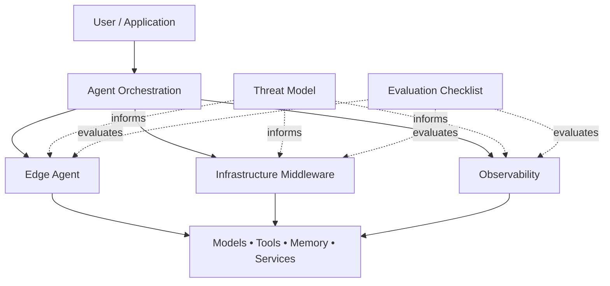

# Architecture Overview

## Repository Blueprints

This document provides a high-level view of the architectural ideas explored throughout the repository.

The repository currently includes the following architecture blueprints:

- [Edge Agent](./edge-agent.md)
- [Infrastructure Middleware](./infrastructure-middleware.md)
- [Observability](./observability.md)
- [Threat Model](./threat-model.md)
- [Evaluation Checklist](./evaluation-checklist.md)

---

## Purpose

This repository explores architectural patterns for building AI agent systems with Koog beyond simple prompt-response workflows.

Rather than focusing on individual APIs or model providers, the goal is to examine how agent systems can be designed to be modular, observable, secure, and maintainable as they become part of larger JVM applications.

The blueprints in this repository intentionally take an **architecture-first approach**. Their purpose is to help developers think about system boundaries, operational concerns, and engineering trade-offs before implementation.

---

## Repository Architecture

The repository currently explores five complementary architectural areas.

Together, these blueprints illustrate how agent systems can separate user interaction, orchestration, infrastructure concerns, operational visibility, security analysis, and evaluation while remaining modular and adaptable.

---

## Repository Coverage

The repository currently focuses on five complementary architectural concerns.

| Blueprint | Primary Focus |
|-----------|---------------|
| Edge Agent | Local and edge execution |
| Infrastructure Middleware | Agent orchestration and system integration |
| Observability | Operational visibility and telemetry |
| Threat Model | Security boundaries and risk analysis |
| Evaluation Checklist | Systematic evaluation before deployment |

Together, these blueprints provide an architecture-first perspective on designing AI agent systems before implementation.

---

## Edge Agent

See:

- [Edge Agent Blueprint](./edge-agent.md)

The Edge Agent blueprint explores local-first execution patterns.

Areas of interest include:

- Local model execution
- LiteRT integration
- Offline workflows
- User privacy
- Local tool execution
- Device resource constraints
- Selective cloud interaction

The objective is to understand where agent capabilities can safely execute closer to the user instead of relying entirely on cloud infrastructure.

---

## Infrastructure Middleware

See:

- [Infrastructure Middleware Blueprint](./infrastructure-middleware.md)

Most production systems require additional infrastructure between an application and the language model.

This blueprint explores middleware responsible for:

- Agent lifecycle management
- Tool registration
- Authentication and authorization
- Request routing
- Memory integration
- Configuration management
- Failure recovery
- Service communication

The middleware acts as the engineering layer that connects Koog agents with existing JVM systems.

---

## Observability

See:

- [Observability Blueprint](./observability.md)

Agent behaviour becomes increasingly difficult to understand as workflows become more autonomous.

The Observability blueprint explores how execution can be inspected through:

- OpenTelemetry traces
- Tool execution spans
- Agent reasoning metadata
- Token usage
- Latency metrics
- Error reporting
- Workflow inspection

The objective is to improve debugging, evaluation, and operational visibility.

---

## Threat Model

See:

- [Threat Model Blueprint](./threat-model.md)

The Threat Model blueprint explores how trust boundaries, permissions, external services, tools, and sensitive resources should be considered when designing AI agent systems.

Areas of interest include:

- Trust boundaries
- Tool permissions
- Credential management
- External service interactions
- Least-privilege access
- Security assumptions
- Risk identification

The objective is to encourage security considerations early in the system design process.

---

## Evaluation Checklist

See:

- [Evaluation Checklist](./evaluation-checklist.md)

Reliable AI agent systems require more than successful demonstrations.

This blueprint explores repeatable evaluation across areas such as:

- Functional correctness
- Reliability
- Security
- Observability
- Performance
- User experience
- Deployment readiness

The objective is to encourage systematic evaluation before deployment.

---

## Shared Design Principles

Although each blueprint addresses different engineering concerns, they share several common principles.

### Modular Design

Components should remain loosely coupled wherever practical.

Models, memory providers, storage systems, and external services should be replaceable without redesigning the entire application.

### Explicit Boundaries

Model execution, tool execution, persistence, and external communication should be represented as explicit architectural boundaries.

### Observable Systems

Agent behaviour should be measurable rather than assumed.

Logging, tracing, metrics, and evaluation should become part of the architecture rather than an afterthought.

### Security by Design

Tool access, credentials, secrets, and external communication should follow least-privilege principles whenever possible.

### Evaluation Before Deployment

Increasing agent autonomy should be supported by repeatable evaluation rather than isolated demonstrations.

---

## Current Scope

The repository currently focuses on architectural exploration.

It does **not** yet provide:

- Production-ready implementations
- Complete reference applications
- Benchmark results
- Security guarantees
- Performance guarantees

These areas may be explored as the repository evolves through future community contributions.

---

## Relationship to Koog

These blueprints are informed by Koog’s agent-development capabilities but are not part of the official Koog project.

They represent an independent community exploration of how Koog-based systems could be structured in real engineering environments.

---

## Future Direction

Future milestones include:

- Refine and expand the architecture blueprints
- Build verified reference implementations through community contributions
- Explore local and edge deployments
- Validate observability patterns
- Experiment with integrations for common JVM frameworks

As the repository evolves, architectural guidance may gradually be complemented by tested community implementations.

---

## Disclaimer

This repository is an independent community project created for architectural exploration, education, and experimentation.

It is **not** affiliated with, endorsed by, or maintained by JetBrains or the official Koog project.
