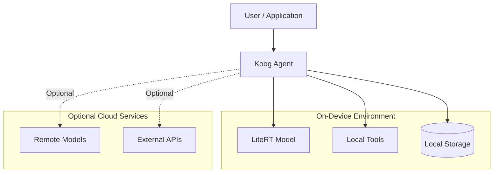
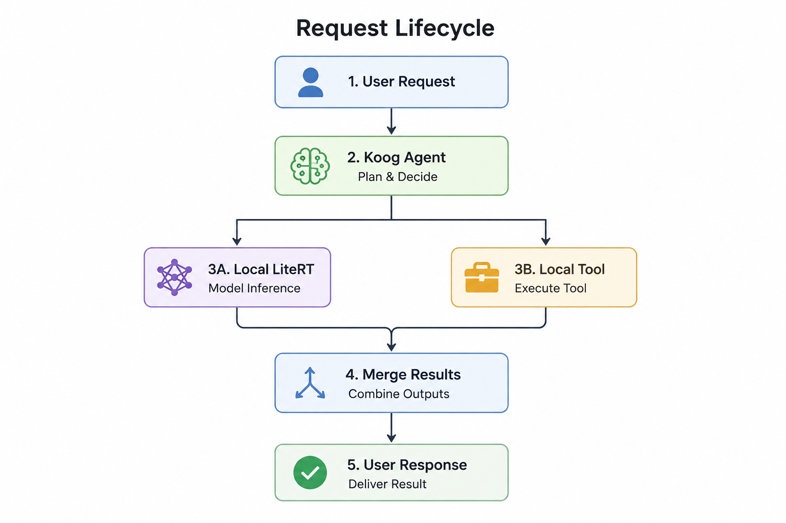

# Edge Agent

## Purpose

This blueprint explores how AI agent systems can execute directly on user devices using Koog, Kotlin Multiplatform, and LiteRT.

Rather than replacing cloud-based architectures, it investigates when local execution provides advantages in privacy, latency, resilience, and user experience. The focus is on architectural patterns and engineering trade-offs rather than framework-specific implementation details.

---

## Motivation

Edge AI enables a different class of agent systems from traditional cloud-only deployments. Running agent orchestration, model inference, and tool execution closer to users can improve responsiveness while reducing dependence on network connectivity.

Potential advantages include:

- Lower inference latency
- Privacy-preserving local execution
- Offline functionality
- Reduced cloud infrastructure costs
- Improved resilience during network interruptions
- Better user control over sensitive data

Not every workload should execute locally. This blueprint focuses on understanding where edge execution is beneficial and how it can complement cloud-based services.

---

## High-Level Architecture

The architecture separates orchestration from execution while clearly distinguishing local capabilities from optional cloud augmentation. This allows agent workflows to remain functional offline while selectively extending capabilities through remote services when appropriate.

---

## Core Components

| Component | Responsibility |
|-----------|----------------|
| **Koog Agent** | Coordinates planning, reasoning, and workflow execution. |
| **LiteRT** | Executes supported language models directly on the device. |
| **Local Tools** | Provides controlled access to device capabilities such as files, sensors, calendars, contacts, or other platform integrations. |
| **Local Storage** | Persists user preferences, conversation history, cached data, and other local state when appropriate, enabling offline functionality and faster local access. |
| **Remote Models (Optional)** | Provides cloud inference when local execution is insufficient or unavailable. |
| **External APIs (Optional)** | Enables retrieval, search, and third-party integrations that require network access. |

---

## Request Lifecycle

The agent determines whether a request can be completed locally or whether optional cloud resources should be used. The objective is to maximize local execution whenever practical while maintaining a consistent user experience.

---

## Trust Boundaries

A key architectural consideration for edge agents is deciding where data is allowed to flow.

Typical trust boundaries include:

- User prompts remain on-device whenever possible.
- Local inference is preferred for privacy-sensitive tasks.
- Tool access follows explicit permission boundaries.
- Cloud communication is optional and initiated only when necessary.
- Secrets and credentials remain isolated from agent reasoning.

Separating local and remote execution enables applications to provide stronger privacy guarantees while still supporting cloud-assisted workflows when appropriate.

---

## Resource Constraints

Unlike server-based deployments, edge environments operate under hardware limitations.

Important considerations include:

- CPU and accelerator availability
- Memory constraints
- Battery consumption
- Thermal throttling
- Storage capacity
- Model size and loading time

Agent workflows should adapt to available resources rather than assuming server-class hardware.

---

## Failure Handling

Edge systems should degrade gracefully rather than fail completely.

Examples include:

- Switching to offline mode when network connectivity is unavailable.
- Falling back to smaller local models when memory is limited.
- Returning partial results if individual tools fail.
- Deferring cloud-dependent operations until connectivity is restored.
- Detecting unsupported hardware capabilities before execution.

Failure handling should prioritize graceful degradation over complete workflow failure, allowing the agent to continue operating with reduced capabilities whenever practical. This approach helps maintain usability across a wide range of devices and execution environments.

---

## Observability Integration

Even when running locally, agent systems benefit from operational visibility.

Useful telemetry includes:

- Workflow execution traces
- Tool invocation history
- Latency measurements
- Resource utilization
- Error events
- Model execution statistics

Detailed guidance on monitoring, tracing, logging, and runtime visibility is provided in the [Observability](./observability.md) blueprint.

---

## Implementation Considerations

Several architectural principles guide this blueprint:

- Prefer local execution for privacy-sensitive workflows.
- Keep orchestration independent of specific model providers.
- Separate platform-specific integrations from shared business logic.
- Design cloud services as optional extensions rather than mandatory dependencies.
- Build workflows that remain functional under degraded network conditions.

These principles encourage architectures that remain portable across supported platforms while taking advantage of Kotlin Multiplatform where appropriate.

---

## Current Scope

This blueprint currently focuses on:

- Architectural exploration
- Engineering guidance
- Design patterns
- System decomposition

It does **not** currently provide:

- Production-ready implementations
- Performance benchmarks
- Hardware-specific tuning
- Deployment guides

These topics may be explored as the repository evolves.

---

## Future Work

Future iterations may explore:

- Hybrid local and cloud orchestration
- Additional on-device model providers
- Secure local memory management
- Energy-aware scheduling
- Benchmarking across different hardware platforms
- Reference implementations demonstrating these architectural patterns

---

## Related Documents

| Document | Description |
|-----------|-------------|
| [Architecture Overview](./architecture-overview.md) | Repository-wide architecture and design philosophy. |
| [Infrastructure Middleware](./infrastructure-middleware.md) | Backend orchestration and middleware patterns for AI agent systems. |
| [Observability](./observability.md) | Monitoring, tracing, logging, and runtime visibility. |
| [Threat Model](./threat-model.md) | Security considerations, trust boundaries, and potential threats. |
| [Evaluation Checklist](./evaluation-checklist.md) | Guidance for evaluating architecture, reliability, and operational readiness. |
