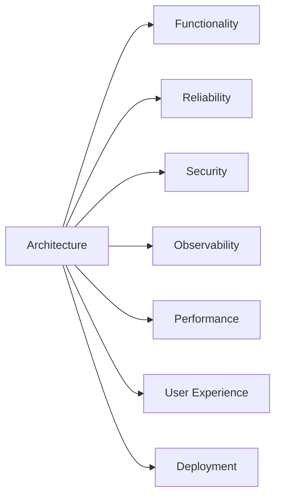

# Evaluation Checklist

## Purpose

This blueprint outlines architectural considerations for evaluating Koog-based agent systems before deployment.

Rather than serving as a formal certification or security standard, it provides a structured framework for reviewing functionality, reliability, security, observability, and operational readiness throughout the agent lifecycle.

---

## Motivation

Evaluating AI agent systems requires more than verifying task completion. Modern agents interact with language models, external tools, workflows, and runtime infrastructure, making evaluation a multidisciplinary process.

A repeatable evaluation process helps teams identify weaknesses, improve reliability, and establish consistent engineering practices before deployment.

Typical evaluation objectives include:

- Verify functional correctness
- Improve reliability
- Reduce operational risk
- Increase system transparency
- Support repeatable engineering reviews

---

## Evaluation Categories

Effective evaluation considers multiple aspects of the system rather than relying on any single performance metric.

---

## Functional Evaluation

### Task Completion

Questions to consider:

- Does the agent complete the intended task?
- Are outputs consistent across repeated executions?
- Are failure cases well understood?

### Tool Usage

Review whether:

- Appropriate tools are selected
- Unnecessary tool calls are avoided
- Tool failures are handled gracefully

### Workflow Execution

Verify:

- Graph transitions are correct
- Retry mechanisms function as expected
- Termination conditions are explicit

---

## Reliability

### Error Handling

Review handling of:

- External service failures
- Model timeouts
- Invalid tool responses
- Partial workflow failures

### Recovery

Consider:

- Retry strategies
- Safe fallbacks
- Graceful degradation
- User notification

Reliable systems should continue operating predictably when individual components fail.

---

## Security

Review areas including:

- Least-privilege permissions
- Restricted filesystem access
- Network limitations
- Secret management
- Prompt injection resistance
- Tool misuse prevention
- Sensitive information handling

Security evaluation should align with the system's threat model and operational requirements.

---

## Observability

Verify that execution provides sufficient operational visibility through:

- Distributed traces
- Tool execution logs
- Latency metrics
- Error reporting
- Token usage
- Workflow inspection

Observability enables effective debugging, performance analysis, and incident investigation.

---

## Performance

Evaluate:

- End-to-end latency
- Tool execution overhead
- Memory consumption
- Concurrent execution
- Model switching costs

Performance objectives should reflect the intended deployment environment and workload.

---

## User Experience

Review aspects such as:

- Response quality
- Failure messaging
- Transparency
- Human intervention points

Evaluation should consider both successful workflows and failure scenarios.

---

## Deployment Readiness

Before production deployment, consider whether:

- Architecture has been reviewed
- Logging is enabled
- Monitoring is configured
- Failure scenarios have been tested
- Security has been reviewed
- Evaluation findings are documented

Deployment readiness extends beyond technical correctness to include operational preparedness.

---

## Current Scope

This blueprint currently focuses on:

- Architectural evaluation
- Engineering review
- Operational readiness
- High-level assessment criteria

It does **not** currently include:

- Formal certification processes
- Quantitative benchmarking
- Compliance requirements
- Organization-specific evaluation procedures

---

## Future Work

Future iterations may explore:

- Quantitative benchmarks
- Automated evaluation pipelines
- Threat modelling guidance
- Domain-specific evaluation criteria
- Continuous evaluation workflows
- Reference evaluation templates

---

## Related Documents

| Document | Description |
|-----------|-------------|
| [Architecture Overview](./architecture-overview.md) | Repository-wide architecture and design philosophy. |
| [Edge Agent](./edge-agent.md) | On-device AI agent architecture patterns. |
| [Infrastructure Middleware](./infrastructure-middleware.md) | Backend orchestration and middleware architecture. |
| [Observability](./observability.md) | Monitoring, tracing, logging, and runtime visibility. |
| [Threat Model](./threat-model.md) | Security considerations and trust boundaries. |
