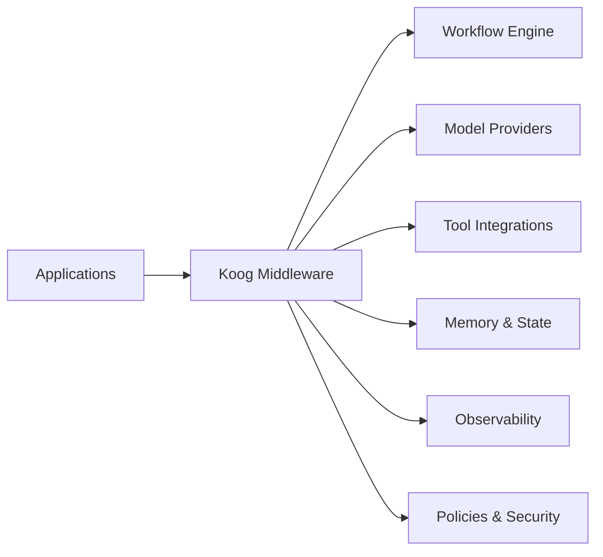

# Infrastructure Middleware

## Purpose

This blueprint explores backend-oriented AI agent architectures built with Koog and the JVM ecosystem.

Rather than focusing on individual models or tools, it examines architectural patterns for orchestration, integrations, observability, persistence, scalability, and operational concerns across AI agent systems.

---

## Motivation

As AI agents become more capable, backend systems require infrastructure that separates orchestration from application logic.

Middleware provides a consistent layer for coordinating workflows, integrating external services, managing state, enforcing policies, and exposing reusable capabilities without tightly coupling applications to specific model providers.

Potential advantages include:

- Centralized orchestration
- Provider abstraction
- Consistent security controls
- Shared observability
- Improved scalability
- Easier maintenance

---

## High-Level Architecture

The diagram above illustrates the broader Koog architecture. The following simplified view highlights the middleware responsibilities discussed in this blueprint.

The middleware coordinates workflows while keeping applications independent of specific providers, deployment environments, and implementation details.

---

## Core Components

| Component | Responsibility |
|-----------|----------------|
| Workflow Engine | Coordinates multi-step agent execution and workflow orchestration. |
| Model Providers | Abstracts interactions with local and cloud language models. |
| Tool Integrations | Connects agents with external APIs, databases, and enterprise systems. |
| Memory & State | Maintains conversation state, workflow context, and persistent memory where appropriate. |
| Policies & Security | Applies authentication, authorization, validation, and execution policies. |
| Observability | Collects logs, traces, metrics, and runtime telemetry. |

---

## Request Lifecycle

A typical backend request may follow these stages:

1. Receive a request from the client.
2. Apply authentication and policy validation.
3. Build workflow context.
4. Coordinate reasoning, planning, and tool execution.
5. Invoke models and external tools as required.
6. Collect telemetry throughout execution.
7. Return the final response.

Each stage should remain independently observable and extensible.

---

## Provider Abstraction

Middleware should avoid depending directly on a single model provider.

Useful abstraction layers include:

- Local models
- Cloud providers
- Future provider integrations
- Mock providers for testing

This enables applications to evolve without significant architectural changes.

---

## Tool Integration

AI agents frequently require controlled access to external systems.

Examples include:

- REST APIs
- Databases
- File systems
- Search services
- Enterprise applications
- MCP-compatible tools

Middleware should expose these integrations through well-defined interfaces while enforcing appropriate security controls.

---

## Persistence and Memory

Long-running agent systems often require durable state beyond a single request.

Future areas of exploration include:

- Conversation state management
- Workflow checkpoints
- Tool execution history
- Context retention across sessions
- Durable storage strategies

The appropriate persistence mechanism depends on application requirements, consistency guarantees, and operational constraints.

---

## Prompt Caching

Prompt caching can help reduce latency and token consumption for repetitive workflows.

Potential areas of interest include:

- Reusable system prompts
- Shared context blocks
- Cost optimization strategies
- Latency reduction techniques
- High-throughput backend scenarios

Prompt caching strategies should balance performance improvements with correctness and cache invalidation considerations.

---

## Security Considerations

Middleware represents an important trust boundary.

Important considerations include:

- Authentication
- Authorization
- Secret management
- Input validation
- Tool permission boundaries
- Request isolation
- Audit logging

Security policies should remain independent of application business logic whenever practical.

---

## Observability Integration

Operational visibility is essential for production AI systems.

Useful telemetry includes:

- Request traces
- Workflow execution
- Tool usage
- Model latency
- Error rates
- Resource utilization

Detailed guidance on monitoring, tracing, logging, and runtime visibility is provided in the [Observability](./observability.md) blueprint.

---

## Scalability Considerations

Middleware should support growth in both workload and complexity.

Architectural strategies include:

- Stateless services where practical
- Horizontal scaling
- Asynchronous execution
- Request queues
- Caching
- Provider failover

The specific implementation depends on deployment requirements.

---

## Current Scope

This blueprint currently focuses on:

- Middleware architecture
- Engineering patterns
- System decomposition
- Operational design

It does **not** currently include:

- Production implementations
- Framework-specific examples
- Deployment configurations
- Performance benchmarks

---

## Future Work

Future iterations may explore:

- Distributed workflow execution
- Multi-agent coordination
- Streaming responses
- Advanced memory architectures
- Policy-driven orchestration
- Reference implementations

---

## Related Documents

| Document | Description |
|-----------|-------------|
| [Architecture Overview](./architecture-overview.md) | Repository-wide architecture and design philosophy. |
| [Edge Agent](./edge-agent.md) | On-device AI agent architecture patterns. |
| [Observability](./observability.md) | Monitoring, tracing, logging, and runtime visibility. |
| [Threat Model](./threat-model.md) | Security considerations and trust boundaries. |
| [Evaluation Checklist](./evaluation-checklist.md) | Guidance for evaluating architecture, reliability, and operational readiness. |
