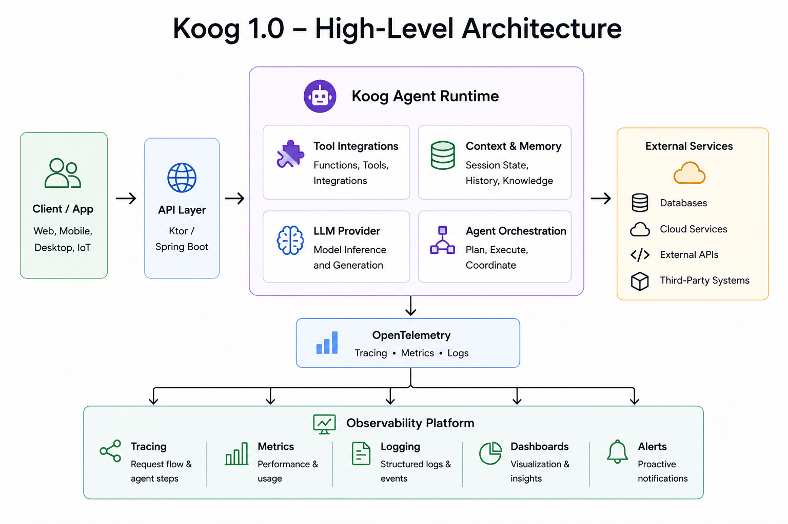

# Infrastructure Middleware

## Overview

This document explores backend-oriented agent architectures built with Koog 1.0 and the JVM ecosystem.

The focus is on orchestration patterns, observability, scalability, persistence, memory, prompt caching, and integration with existing backend services.

## High-Level Architecture

## Areas of Interest

* Ktor integration patterns
* Spring Boot integration patterns
* Agent orchestration workflows
* Prompt management strategies
* Service-to-service integrations
* Scalability considerations
* Persistence and memory patterns for long-running agents
* Prompt caching strategies for reducing latency and token usage

## Long-Running Agent Considerations

### Persistence and Memory

Future areas of exploration include persistence and memory patterns for long-running agent workflows.

Potential areas of interest:

- Conversation state management
- Workflow checkpoints
- Tool execution history
- Context retention across sessions
- Durable storage strategies

### Prompt Caching

Prompt caching can help reduce latency and token consumption for repetitive workflows.

Potential areas of interest:

- Reusable system prompts
- Shared context blocks
- Cost optimization strategies
- Latency reduction techniques
- High-throughput backend scenarios

## Status

Exploration and design phase.
