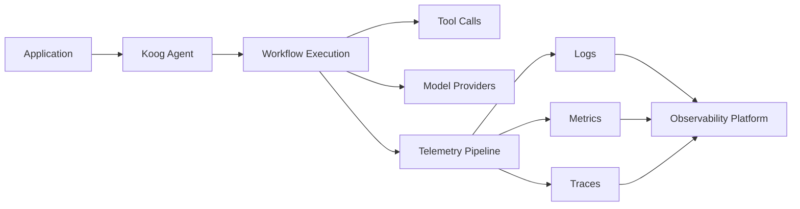

# Observability

## Purpose

This blueprint explores architectural patterns for observing, tracing, and monitoring AI agent execution across local and distributed environments.

Rather than focusing on specific tooling, it examines how observability supports debugging, reliability, performance analysis, and operational visibility throughout the agent lifecycle.

---

## Motivation

As AI agents become increasingly autonomous and interact with external tools, services, and multiple models, understanding their runtime behaviour becomes significantly more challenging.

Observability enables developers and operators to inspect workflows, diagnose failures, measure performance, and understand system behaviour without modifying application logic.

Potential benefits include:

- Improved debugging
- Runtime visibility
- Performance optimization
- Operational reliability
- Easier incident investigation
- Better system understanding

---

## High-Level Architecture

Observability captures telemetry across the complete execution lifecycle, enabling developers and operators to understand both high-level workflows and individual execution events.

---

## Core Components

| Component | Responsibility |
|-----------|----------------|
| Logging | Captures runtime events, errors, and operational information. |
| Metrics | Measures latency, throughput, resource utilization, and system health. |
| Tracing | Records execution flow across workflows, tools, and services. |
| Workflow Inspection | Enables visibility into multi-step agent execution. |
| Performance Monitoring | Identifies bottlenecks and resource-intensive operations. |

---

## Observability Lifecycle

Typical observability workflows include:

1. Receive an agent request.
2. Generate telemetry throughout execution.
3. Capture logs, metrics, and traces.
4. Correlate execution across workflows and external services.
5. Analyze failures or performance bottlenecks.
6. Use collected insights to improve system reliability.

Each stage should remain independently observable while contributing to a complete operational picture.

---

## Logging

Useful logging practices include:

- Workflow events
- Tool execution
- Model requests
- Errors and exceptions
- Security-relevant events
- Configuration changes

Logs should provide sufficient context while avoiding unnecessary exposure of sensitive information.

---

## Metrics

Useful operational metrics include:

- Request latency
- Workflow duration
- Tool execution time
- Token usage
- Error rates
- Resource utilization

Metric selection should reflect application goals and operational requirements.

---

## Distributed Tracing

Tracing enables visibility across complex workflows spanning multiple systems.

Potential areas of interest include:

- Agent execution flow
- Tool invocations
- External API requests
- Model provider interactions
- Service-to-service communication

OpenTelemetry provides one widely adopted approach for collecting distributed traces.

---

## Debugging and Workflow Inspection

Complex agent workflows benefit from inspection capabilities that allow developers to understand execution decisions.

Examples include:

- Workflow visualization
- Execution timelines
- Tool invocation history
- Intermediate reasoning state where appropriate
- Failure analysis

The appropriate level of inspection depends on operational and privacy requirements.

---

## Operational Considerations

Effective observability should balance operational visibility with cost and performance.

Important considerations include:

- Sampling strategies
- Data retention
- Storage costs
- Privacy
- Sensitive data handling
- Telemetry overhead

---

## Current Scope

This blueprint currently focuses on:

- Observability architecture
- Monitoring concepts
- Operational visibility
- Engineering patterns

It does **not** currently include:

- Vendor-specific tooling
- Deployment guides
- Production dashboards
- Reference implementations

---

## Future Work

Future iterations may explore:

- Advanced telemetry pipelines
- Workflow replay
- Alerting strategies
- AI-assisted debugging
- Automated anomaly detection
- Reference implementations

---

## Related Documents

| Document | Description |
|-----------|-------------|
| [Architecture Overview](./architecture-overview.md) | Repository-wide architecture and design philosophy. |
| [Edge Agent](./edge-agent.md) | On-device AI agent architecture patterns. |
| [Infrastructure Middleware](./infrastructure-middleware.md) | Backend orchestration and middleware architecture. |
| [Threat Model](./threat-model.md) | Security considerations and trust boundaries. |
| [Evaluation Checklist](./evaluation-checklist.md) | Guidance for evaluating architecture, reliability, and operational readiness. |
