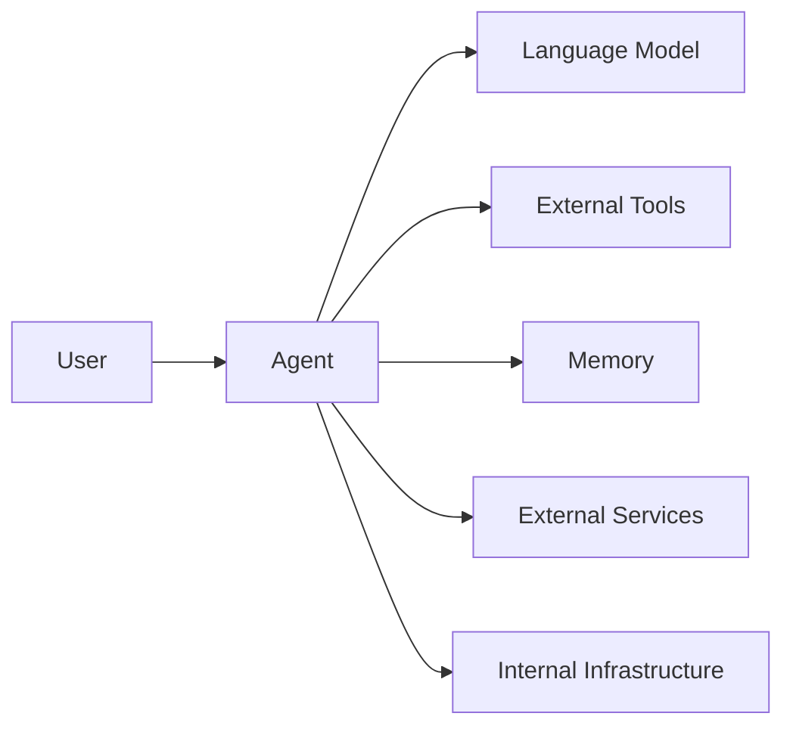

# Threat Model

## Purpose

This blueprint explores architectural considerations for identifying trust boundaries, understanding common risks, and designing secure AI agent systems built with Koog.

Rather than providing a comprehensive security framework, it encourages security-first architectural thinking throughout the design and development lifecycle.

---

## Motivation

AI agents increasingly interact with language models, external tools, APIs, persistent memory, and enterprise systems. These capabilities introduce additional trust boundaries and potential attack surfaces beyond those found in traditional software systems.

A structured threat model helps developers identify risks early, design appropriate mitigations, and reduce the likelihood of security failures as systems evolve.

Primary objectives include:

- Protect sensitive data
- Restrict unnecessary capabilities
- Maintain system integrity
- Support auditing and incident response
- Reduce operational risk

---

## Trust Boundaries

Typical trust boundaries include:

- User ↔ Agent
- Agent ↔ Language Model
- Agent ↔ Tools
- Agent ↔ External Services
- Agent ↔ Memory
- Agent ↔ Internal Infrastructure

Each boundary should explicitly define which information, permissions, and capabilities are permitted to cross it.

---

## Threat Categories

### Prompt Injection

Potential risks include:

- Malicious instructions
- Hidden prompts
- Tool manipulation
- Data exfiltration attempts

Prompt injection should be treated as an architectural concern rather than solely a prompt engineering problem.

---

### Tool Misuse

Potential examples include:

- Unauthorized filesystem access
- Unsafe command execution
- Excessive API usage
- Network abuse

Tool access should be constrained according to the principle of least privilege.

---

### Data Exposure

Sensitive information may include:

- API keys
- Credentials
- Personal information
- Internal documents
- Conversation history

Appropriate handling of sensitive data should be considered throughout the system lifecycle.

---

### Model Risks

Potential concerns include:

- Hallucinated outputs
- Unsafe recommendations
- Incorrect tool selection
- Excessive autonomy
- Memory poisoning

These risks often require layered mitigations rather than relying on model behavior alone.

---

### External Dependencies

Operational failures may arise from:

- API outages
- Network failures
- Third-party service changes
- Dependency vulnerabilities

Systems should be designed to degrade gracefully when external dependencies become unavailable.

---

## Security Controls

Useful architectural controls include:

- Principle of least privilege
- Input validation
- Output verification
- Tool allowlists
- Secret management
- Authentication and authorization
- Human approval for sensitive actions
- Comprehensive logging and monitoring

The specific combination of controls depends on system requirements and risk tolerance.

---

## Operational Considerations

Security extends beyond application design.

Operational practices may include:

- Access controls
- Audit logging
- Incident response procedures
- Configuration management
- Dependency management
- Security reviews

Operational security should evolve alongside the system as new capabilities and integrations are introduced.

---

## Current Scope

This blueprint currently focuses on:

- Trust boundaries
- Threat categories
- High-level mitigation strategies
- Security architecture

It does **not** currently include:

- Formal threat modelling methodologies
- Penetration testing
- Compliance requirements
- Organization-specific security processes

---

## Future Work

Future iterations may explore:

- Example attack scenarios
- Threat modelling templates
- Reference security architectures
- Runtime policy enforcement
- Agent sandboxing strategies
- Practical mitigation patterns

---

## Related Documents

| Document | Description |
|-----------|-------------|
| [Architecture Overview](./architecture-overview.md) | Repository-wide architecture and design philosophy. |
| [Edge Agent](./edge-agent.md) | On-device AI agent architecture patterns. |
| [Infrastructure Middleware](./infrastructure-middleware.md) | Backend orchestration and middleware architecture. |
| [Observability](./observability.md) | Monitoring, tracing, logging, and runtime visibility. |
| [Evaluation Checklist](./evaluation-checklist.md) | Guidance for evaluating architecture, reliability, and operational readiness. |
