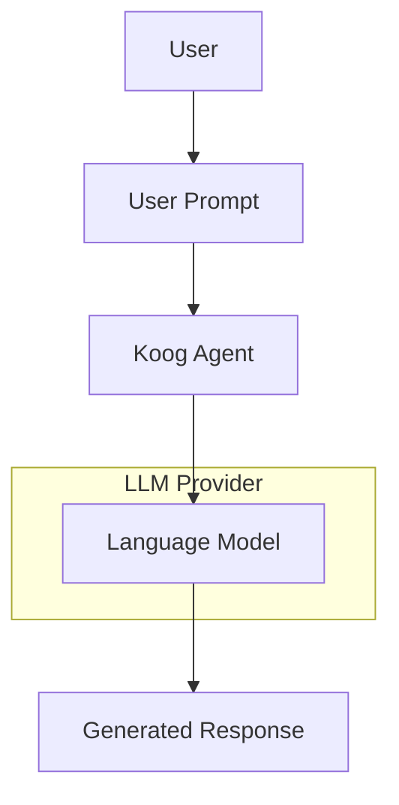
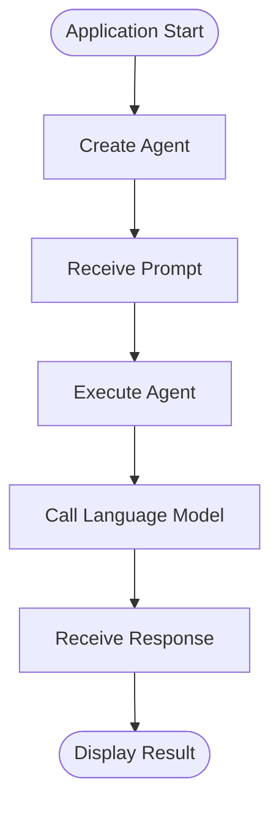

# 01 — Minimal Agent

> The smallest end-to-end Koog agent demonstrating the core request–response workflow.

This example introduces the foundational concepts of building AI agents with Koog. It focuses exclusively on the simplest possible agent lifecycle before introducing tools, memory, observability, evaluation, and other architectural capabilities in later examples.

---

## Overview

AI agent systems become easier to understand when individual architectural concepts are introduced one at a time.

This example demonstrates the complete request–response lifecycle:

- Receive a user prompt
- Execute a Koog agent
- Send the prompt to a configured language model
- Return the generated response

No additional infrastructure is introduced.

---

## Architecture



---

## Learning Objectives

After completing this example, readers should understand how to:

- Configure a minimal Koog project
- Create a basic AI agent
- Execute a single prompt
- Receive and display the generated response
- Configure model credentials using environment variables

---

## Related Blueprints

This example complements the following architecture documents:

- [Architecture Overview](../../docs/architecture-overview.md)
- [Infrastructure Middleware](../../docs/infrastructure-middleware.md)

---

## Project Structure

```text
01-minimal-agent/
├── README.md
├── build.gradle.kts
├── settings.gradle.kts
└── src/
    └── main/
        └── kotlin/
            └── Main.kt
```

---

## Run

The runnable implementation will be added in a future update.

Once available, the example can be executed from this directory:

```bash
./gradlew run
```

The implementation will require:

- JDK 17 or later
- Gradle 8+
- A supported LLM provider API key configured through environment variables

---

## Scope

This example intentionally demonstrates only the core request–response workflow.

It does **not** include:

- Tool calling
- Agent memory
- Retrieval-Augmented Generation (RAG)
- Persistent storage
- Observability
- Evaluation workflows
- Multi-agent orchestration
- Production deployment
- Security hardening

Each of these concepts is introduced separately in later examples.

---

## Example Workflow



---

## Future Examples

This example is the first step in the planned learning path:

1. Minimal Agent
2. Tool-Enabled Agent
3. Observable Agent
4. Evaluation Workflow

Each example introduces one additional architectural capability while remaining independently understandable.

---

## Contributing

Suggestions, improvements, and example enhancements are welcome.

Please review the repository's [Contributing Guide](../../CONTRIBUTING.md) before opening an issue or pull request.

---

## Disclaimer

This example is intended for architectural exploration, learning, and community discussion.

It is not intended to represent a production-ready implementation or official Koog guidance.
