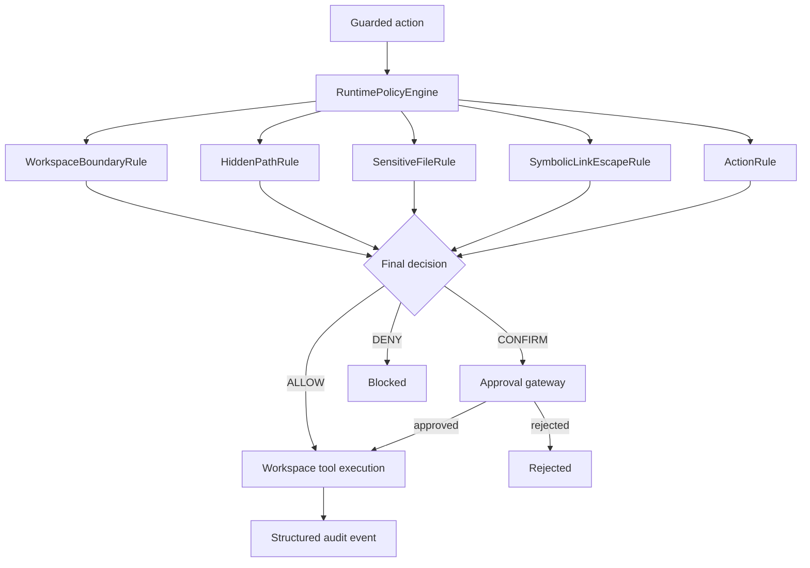

# Guarded Tool Agent

This example evolves the earlier guarded workspace demo into a reusable, deterministic runtime policy engine for Kotlin. The model may propose an action, but the policy engine remains the final authority for allow/confirm/deny decisions before any workspace mutation occurs.

## Purpose

This example is a reference architecture for a guarded tool layer in Kotlin. It demonstrates how a deterministic policy can enforce a clear allow/confirm/deny decision before workspace filesystem operations execute.

## Runtime Policy Engine Architecture

The implementation is intentionally simple and explicit. A small set of composable rules evaluates the request in a fixed order, and the engine resolves the final decision using the precedence DENY > CONFIRM > ALLOW.



## Deterministic Precedence

The engine evaluates all applicable rules and then selects the highest-precedence decision. The precedence model is:

- DENY wins over everything.
- CONFIRM wins over ALLOW.
- ALLOW is the default when no stricter rule matches.

This design avoids accidental weakening of explicit denies and keeps the result stable regardless of the order in which the rules are declared.

## Policy Composition

The workspace protections are implemented as reusable rules that can be composed independently of Koog:

- Workspace boundary enforcement
- Path traversal prevention
- Hidden-path protection
- Sensitive-file protection
- Symbolic-link escape protection
- Deletion confirmation

These rules are layered through the runtime policy engine, and the existing tool layer calls the engine before any filesystem operation executes.

## Approval Flow

Actions that require confirmation are routed through the approval gateway. The gateway may approve or reject the execution, and the tools only proceed when the decision is ALLOW or when a CONFIRM decision receives approval.

## Audit Flow

Every guarded action emits an audit record with the action, target, final decision, human-readable reason, matched rule identifiers, whether confirmation was required, whether approval was granted, and the execution outcome. The example does not log secrets or file contents.

## Running the Demo

```bash
./gradlew run
```

The demo shows:

- an allowed operation
- a confirmation-required operation
- a denied operation
- the corresponding audit output

## Running Tests

```bash
./gradlew test
```

## Limitations and Non-Production Disclaimer

This example is a focused reference implementation for deterministic policy evaluation and approval gating. It is not a production security framework, not a distributed authorization service, and not a substitute for full application-level review or compliance controls.
