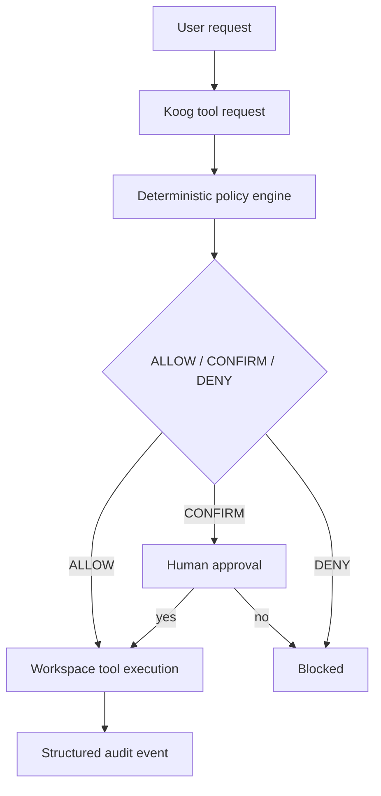

# Guarded Tool Agent

This example explores a deterministic execution boundary for Koog-style tool usage. The model may propose an action, but the policy engine must decide whether that action is allowed to execute.

## Purpose

This example is a reference architecture for a guarded tool layer in Kotlin. It demonstrates how a deterministic policy can enforce a clear allow/confirm/deny decision before any workspace filesystem mutation occurs.

## Architecture

The flow is intentionally simple and explicit:



## Trust Boundary

The trust boundary is the workspace tool layer. The model is not trusted to authorize its own execution. The deterministic policy engine is the component that makes the final decision.

Prompt guidance is not security. The policy engine provides the security boundary.

## Policy Table

| Action | Decision | Reason |
| --- | --- | --- |
| list workspace files | ALLOW | Listing inside the sandbox is permitted |
| read normal workspace file | ALLOW | Safe file reads are permitted |
| create file | CONFIRM | Writes require explicit approval |
| overwrite file | CONFIRM | Writes require explicit approval |
| delete file | CONFIRM | Deletions require explicit approval |
| traversal outside workspace | DENY | Path escape is blocked |
| absolute external path | DENY | Absolute paths are blocked |
| hidden files or directories | DENY | Hidden paths are blocked |
| .env or secret-like filenames | DENY | Sensitive paths are blocked |
| symlink escape | DENY | Symlink escapes are blocked |
| unknown operations | DENY | Unknown operations are denied by default |

## Project Structure

- src/main/kotlin/dev/karan/koog/guardedtoolagent/GuardDecision.kt
- src/main/kotlin/dev/karan/koog/guardedtoolagent/GuardedAction.kt
- src/main/kotlin/dev/karan/koog/guardedtoolagent/ToolPolicy.kt
- src/main/kotlin/dev/karan/koog/guardedtoolagent/ApprovalGateway.kt
- src/main/kotlin/dev/karan/koog/guardedtoolagent/Audit.kt
- src/main/kotlin/dev/karan/koog/guardedtoolagent/GuardedWorkspaceTools.kt
- src/main/kotlin/dev/karan/koog/guardedtoolagent/Main.kt
- src/test/kotlin/dev/karan/koog/guardedtoolagent/GuardedWorkspaceToolsTest.kt

## Running

```bash
./gradlew run
```

## Testing

```bash
./gradlew test
```

## Live Koog Example

This example is intentionally runnable without an API key. The policy layer and demo work entirely locally. If an API key is available, the same guarded tool boundary can be composed with a minimal live Koog agent adapter by wiring the deterministic policy before tool execution.

## Limitations

This example is exploratory and not production-ready. It demonstrates a reference architecture and deterministic control flow, but it does not attempt to provide a full authorization system, distributed approval workflow, persistent audit backend, or policy DSL.
